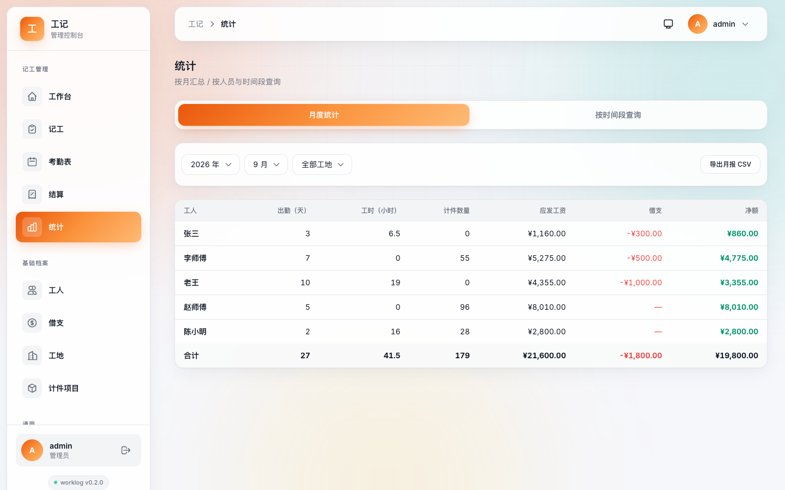

# 工记 WorkLog

记工记账应用，面向班组 / 包工头 / 个体用工：**按天、按时、计件记工，工资自动计算**，
借支与结算管理，一键月结并生成工资条，支持数据导出备份。

在飞牛 fnOS 上可通过 NAS 账号一键登录；也支持 Docker 与裸二进制部署。

## 界面预览

> 以下截图为 v0.2.0 实拍，数据为演示用示例数据。

**工作台**：本月应付、待结算与借支提醒一目了然


**记工**：点工 / 点时 / 计件三种录入，计件项目自动带出默认单价


**考勤表**：整月出勤日历与当月工钱汇总


**结算**：未结算汇总按人核对应发、借支与净应付


**统计**：月度统计与自定义时间段查询



**深色主题**：工地夜间也能看清记工明细


**手机端**（390 × 844）：记工与考勤

<p>
  
  
</p>

其余截图（手机端工作台、工人列表、借支、数据备份）见
[images/screenshots/](images/screenshots/)，同一套图也随发行目录分发（`release/<版本>/screenshots-<版本>.zip`）。

## 功能

### 记工（核心）
- 三种计薪方式：点工（按天，支持半天）/ 点时（按小时）/ 计件（数量 × 单价）
- 单价自动带出：工人默认日薪 / 时薪、计件项目默认单价，单条可覆盖
- 工资实时计算，服务端以整数「分」存储，避免浮点误差
- 日历式记工页，移动端优先，30 秒完成一笔录入
- 工地 / 项目维度（选填），统计可按工地筛选

### 角色与班组（v0.2）
- 老板 / 组长 / 员工三种角色：老板建班组，凭邀请码加入
- 组长可帮工人记工、记借支；**员工只能给自己记工**，可查看自己的考勤、工资、结算单
- 考勤表：月历展示每个工人的出勤（1个工 / 0.5个工 / 小时 / 件 / 休），月度汇总工钱
- 休息标记、多天连记、确认并再记一笔
- 未结工资按人结算 / 按项目（工地）结算

### 结算与工资条
- 未结算汇总：按工人实时汇总应发、借支、净应付
- 单人结算 / 一键月结，结算后记录锁定，可撤销重结
- 工资条：明细 + 借支抵扣 + 实发 + 签字栏，一键导出 PNG 图片（微信直接发给工人）或复制文字
- 已结账记录：按工人 / 时间段查询，导出 CSV

### 借支
- 记录工人预支（现金 / 微信 / 支付宝），结算时自动抵扣

### 统计
- 月度统计：每人工人出勤天数、工时、计件数量、应发工资、借支、净额
- 按人员 + 时间段自定义查询，明细与汇总，CSV 导出

### 数据安全
- 所有数据本地 SQLite（WAL 模式），不联网、不上报
- 数据按用户隔离，多用户互不可见
- CSV / JSON 导出，管理员可下载数据库快照备份

### 账号与安全
- 用户名密码注册登录，第一个注册用户自动成为管理员
- 飞牛 fnOS NAS 账号一键登录（自动绑定 / 注册）
- 管理员：用户管理、系统配置、审计日志

## 技术栈

- 后端：Go、Gin、GORM、SQLite（WAL），模块化应用注册（`server/worklog/`）
- 前端：Vue 3、TypeScript、Vite、Pinia、Tailwind CSS，深浅色双主题
- 默认端口：`8909`；默认数据库路径：`data/db/worklog.db`

## 本地运行

```bash
make dev        # 构建前后端并启动（模拟生产目录结构）
# 或分别构建
make build      # 前端 + 后端
./worklog -data-dir ./data -port 8909
```

## Docker 部署

```bash
docker compose up -d          # 端口 8909，数据卷 worklog-data
```

## 飞牛 fnOS 打包

```bash
make fnpack    # 产出 release/<版本>/techfunway-worklog.fpk（amd64 + arm64）
```

## 设计文档

见 [docs/](docs/)：需求分析、概要设计、详细设计。

## 支持作者

如果工记帮到了你，欢迎微信扫码请作者喝杯咖啡——金额随意，1 元也是心意：

<p align="center">
  
</p>

应用内的赞赏入口（启动弹窗、顶部横幅、支持入口）随时可用；支持记录按版本号记忆，升级到新版本后会再次提醒。支持完全自愿，不支付不影响任何功能。
